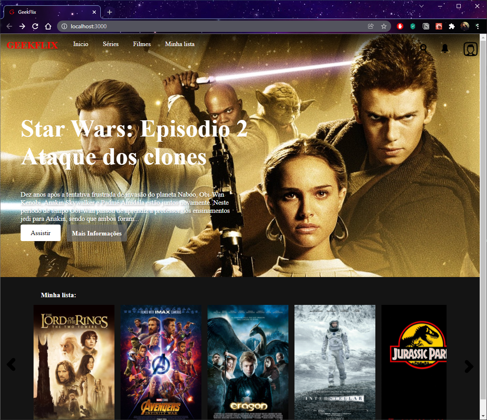
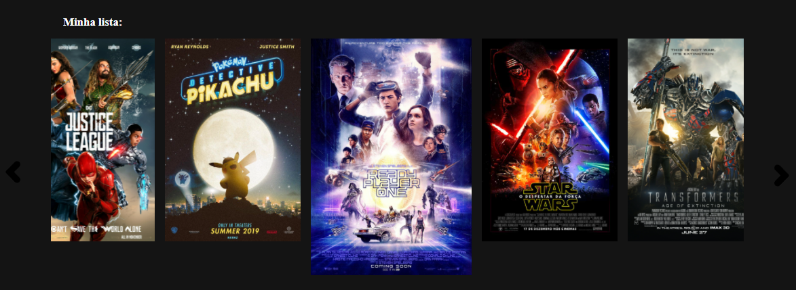

# GeekFlix

<h4 align="center">
	🚧  Incomplete  🚧
</h4>

Table of Contents
=================
<!--ts-->
   * [About project](#About-Project)
   * [Technologies](#-Technologies)
   * [Preview of Project](#Preview-of-Project)
   * [Author](#Author)
<!--te-->

## About project

This project i made a clone of NetFlix using React. 

In this project i used:

* [Create React App](https://github.com/facebook/create-react-app) to start the project.
* [Styled Components](https://styled-components.com/) to styled the project.

## 🛠 Technologies

The following tools were used in the construction of the project:

- [React](https://pt-br.reactjs.org/)
- [Styled Components](https://styled-components.com/)

 ##  Preview of Project

  
  

### Author
---
Made by Guilherme Cabral 👋🏽 Contact me!

